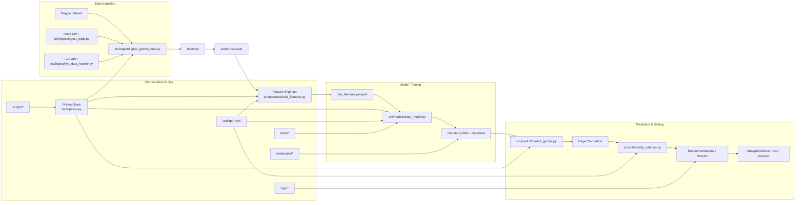

## Architecture Diagram

```mermaid
flowchart LR
  subgraph Ingest["Data Ingestion"]
    KAG[Kaggle dataset] --> ING[src/ingest/ingest_games_new.py]
    ODDS[Odds API / src/ingest/ingest_odds.py] --> ING
    LIVE[Live API / src/ingest/live_data_fetcher.py] --> ING
  end

  ING --> RAW[data/raw]
  RAW --> PROC[data/processed]
  PROC --> FEAT[Feature Engineer\nsrc/features/build_features.py]
  FEAT --> PARQ[nba_features.parquet]

  subgraph Training["Model Training"]
    PARQ --> TRAIN[src/models/train_model.py]
    TRAIN --> MODELS[models/*.joblib + metadata]
  end

  subgraph Prediction["Prediction & Betting"]
    MODELS --> PRED[src/predict/predict_games.py]
    PRED --> EDGES[Edge Calculation]
    EDGES --> KELLY[src/stake/kelly_criterion.py]
    KELLY --> RECS[Recommendations / Reports]
    RECS --> OUT[data/predictions/*.csv / reports/]
  end

  subgraph Orchestration["Orchestration & Ops"]
    PREFECT["Prefect flows\nsrc/pipeline.py"] --> ING
    PREFECT --> FEAT
    PREFECT --> TRAIN
    PREFECT --> PRED
    SCRIPTS[scripts/*] --> PREFECT
    CONFIGS[configs/*.yml] --> FEAT
    CONFIGS --> TRAIN
    CONFIGS --> KELLY
    LOGS[logs/*] --> RECS
    NOTEBOOKS[notebooks/*] --> MODELS
    TESTS[tests/*] --> TRAIN
  end

```

This file documents the main data flow and component responsibilities.
